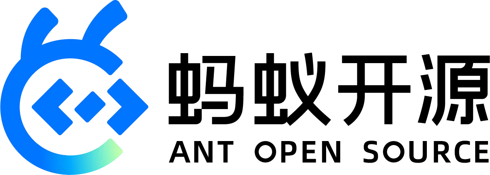
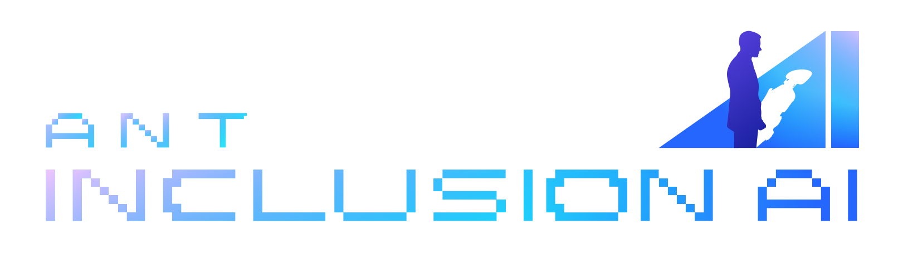
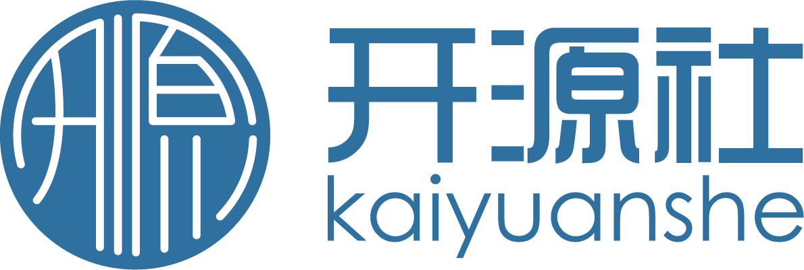

# Agentic AI Landscape and Trends


[](https://agi-landscape.my.canva.site)
[](https://www.inclusion-ai.org/insight)


🧐 **Latest Blog**: [Agentic AI 2026: When the Hackathon Fever Cools Down](https://www.inclusion-ai.org/blog/agentic-ai-202606/)

---

## Agentic AI Landscape 2026

The 2026 landscape maps two infrastructure blocks: **Agent Infra** organizes the application, framework, runtime, and tool ecosystem; **Model Infra** covers the data, training, serving, and deployment stack.

The landscape highlights the projects that are currently most representative of each ecosystem rather than attempting to cover every project. Visit [InclusionAI Insights](https://www.inclusion-ai.org/insight/) for more complete and dynamic Agentic AI ecosystem rankings, project data, and developer details.


---

## Insights

- [Landscape reports](./insights) — dated, bilingual analyses of how each layer of the ecosystem is evolving.
- [Case studies](./insights/case_studies) — deep dives into single projects or themes.
- [Weekly reports](./insights/weekly_reports_by_agents) — automatically generated snapshots of newly surfacing projects.

## Data

The canonical dataset is [`data/agentic-ai-projects.csv`](./data/agentic-ai-projects.csv). Each row is keyed by the GitHub `repo_id`, carries GitHub metadata (stars, forks, license, language, topics), OpenDigger signals (`openrank_*`, `participants_*`), and the curation fields that record why a project is in the landscape (`landscape_layer`, `landscape_section`, `selection_reason`, `selection_caveat`).

Project vitality is measured with [OpenRank](https://github.com/X-lab2017/open-digger) rather than raw star counts, so activity from issues, pull requests, reviews, and contributors is taken into account.

## Landscape Website

The production Next.js application lives in [`apps/landscape-web`](./apps/landscape-web) and reads the canonical project dataset above directly. Run it locally with:

```bash
cd apps/landscape-web
npm ci
npm run dev
```

The existing production address is [landscape-demo-omega.vercel.app](https://landscape-demo-omega.vercel.app/). Vercel should use `apps/landscape-web` as the project Root Directory.

## Maintaining The Agentic AI Projects

We aim to continuously maintain and expand [`data/agentic-ai-projects.csv`](./data/agentic-ai-projects.csv) with **noteworthy** projects across the Agentic AI ecosystem. If you think an important project is missing, please share it through our [dedicated issue tracker](https://github.com/antgroup/agentic-ai-landscape/issues/1).

The data collection and publishing code lives in [`scripts/`](./scripts). To run it locally:

```bash
python3 -m venv .venv
.venv/bin/pip install -r requirements.txt
# then fill in scripts/.env with GitHub, ClickHouse, and publishing credentials
```

Weekly report and ecosystem insight operations are documented in [`WORKFLOW.md`](./WORKFLOW.md); repository conventions for contributors and coding agents are in [`AGENTS.md`](./AGENTS.md).

## Initiated by Communities

<p align="center">
  &nbsp;&nbsp;&nbsp;&nbsp;
  &nbsp;&nbsp;&nbsp;&nbsp;
  
  <br><br>
  &nbsp;&nbsp;&nbsp;&nbsp;
  
</p>
